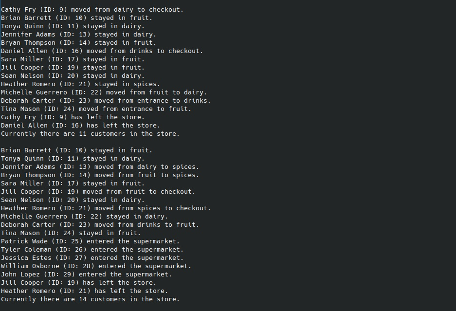

# Supermarket Simulation

### Using _Markov Chains_ and _Monte Carlo Simulation_ to analyse customer movements in a supermarket. Includes an animated visualization based on Python classes.

A collaboratvie Data Science project by [Shivani Rekala](https://github.com/shivs31), [Özlem Ünal Logacev](https://github.com/ozlemunal), and [Jan Kühn](https://github.com/yotkadata). This project was part of the Data Science Bootcamp at SPICED Academy from April to June 2023.

### Data preparation

Data Analysis and preparation are done in Jupyter Notebooks you can find in the `/notebooks` directory. The results are then saved as CSV files in `/data` and will be used by the Classes for simulation and animation.

### Simulation and animation

Simulation and animation are controlled by two classes defined in `main.py`: `Supermarket` and `Customer`.

### Run

To see the result, prepare a Python environment, install dependencies defined in `requirements.txt` and run `main.py`:

```bash
git clone https://github.com/yotkadata/simulation_project
cd simulation_project/
pip install -r requirements.txt
python main.py
```



